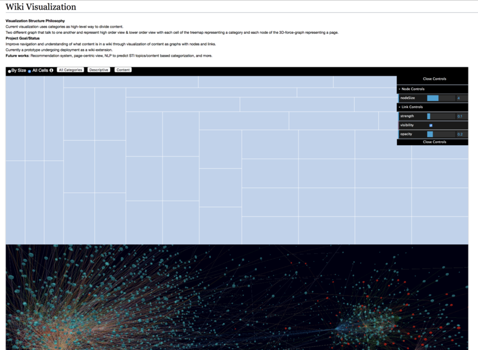

# Wiki-3D-force-graph

##Note
Due to NASA's export control policy, no codes are available for external use.

## Project Purpose
Wikis grows organically through the efforts of many people. They don't follow a table of contents or a roadmap. When Wikis get large they can become difficult to navigate. The standard way of navigation is either search bar or following links from page to page. This only gives a small-scale perspective of overall wiki structure. We wanted to build a tool that allowed the larger scale structure of a wiki to be visualized even if there were 10,000s of pages. We believe this will help speed navigation and encourage more use of wikis.

## Summary of what has been built

We've explore multiple different graph visualization styles including 2D and 3D graphs, network confusion matrixes, and treemaps.

For phase I, what we've decided is useful to deploy for others, and not just live on our local computers, is a 2D treemap of wiki page categories scaled by number of pages. Clicking on a category block in the treemap spawns a 3D network visualization of all the pages within that category lower on the page. Clicking on individual nodes in this 3D view gives you the name of each page. The type of hyperlink is visualized by the color of the link in the network. The 3D treemap leverages a library called 3d-force-graph [model](https://github.com/vasturiano/3d-force-graph) that uses webGL and d3.js.

## Screenshots/Demo

.gif)
.gif)
.gif)
.gif)
.gif)

## Architecture
 
MediaWiki Wiki architecture allow us to extract a large amount of information about the pages, their categories, their properties, and links between them via either direct calls to the mysql database or API calls. This project basically extract data about pages and the links between pages as jsons, processes those jsons into a form useful for what we want to see, and then visualizes the information in a form we think is useful.

Due to the time required to extract this information from the database and process it, we take an approach to extract and process data every some many hours. If we were to try to have the data be pulled in real time every time the user went to our visualization page, the user would be forced to wait too long. There might be clever ways to have some of the data pulled in real-time, but those are features that would only be implemented in the future.

  
## Links/Libraries
 
### Useful links
- [3D-Force-Directed-Graph](https://github.com/vasturiano/3d-force-graph): A web component to represent a graph data structure in a 3-dimensional space using a force-directed iterative layout.
- [dat.GUI](https://workshop.chromeexperiments.com/examples/gui/#1--Basic-Usage): A lightweight graphical user interface for changing variables in JavaScript.
- [API Sandbox](https://www.mediawiki.org/wiki/API_sandbox): Use this page to experiment with the MediaWiki web service API.
- [MediaWiki API Main Page](https://www.mediawiki.org/wiki/API:Main_page): More information on MediaWiki API

## Future Work:
- More features in UI (scale of neighbor nodes highlight, hide links based on type, etc)
- New window based on the clicked node to visualize it isolated with its directly linked nodes
- Connect to backend and run on the Wiki itself
- Particle speed in highlighted link of 3D-force-graph can be representative of a variable